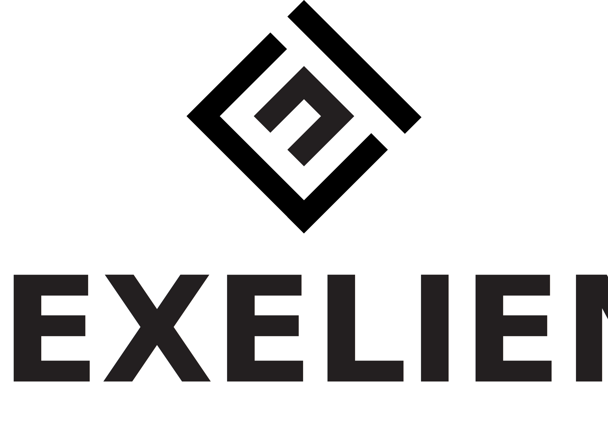

# Adopters

Organizations and teams running Reloader in production.

This list exists to help the community understand real-world usage patterns and
to give visibility to the teams that have made Reloader part of their infrastructure.
It also helps us prioritize what to build next.

**Want to be listed?**
Open a PR — add your logo to [`/adopters/logos/`](./logos/) and a row to the
table below. See the [contribution guide](#how-to-add-your-organization) at the
bottom of this page.

---

## Organizations Using Reloader

<!-- LOGO GRID START -->
| | | | | |
|:---:|:---:|:---:|:---:|:---:|
|  |  | | | |
<!-- LOGO GRID END -->

---

## Adopter Details

| Organization | Quote | Use Case | Scale | Since |
|---|---|---|---|---|
| **Stakater Cloud** | "Reloader is foundational to Stakater Cloud — every secret rotation, config change, and cert renewal, handled automatically." | Secret rotation, Cert Renewal, Config Propagation | 4 regions, 800+ namespaces | 2024 |
| **Exelient AB** | "The cert-manager + Reloader combo is gold. Renewed certs, live and hassle-free." | Secret rotation, Cert Renewal, Config Propagation | 1 cluster, 3 namespaces | 2026 |

---

## How to Add Your Organization

Adding your organization takes about 5 minutes and means a lot to the project.

### Option A — Pull Request (gets you a logo in the grid)

1. Fork the repository
2. Add your logo to [`/adopters/logos/`](./logos/)
   - SVG preferred, PNG accepted
   - Name the file after your company: `acme-corp.svg`
   - Keep it under 100KB
3. Add a row to the **Adopter Details** table above
4. Open a PR with the commit title: `docs: add <YOUR COMPANY> to ADOPTERS.md`

### Option B — GitHub Discussion (quickest, no git required)

Drop a comment in the
[👋 Show & Tell: Who's using Reloader?](https://github.com/stakater/Reloader/discussions/1137)
discussion using this template:

```
**Company / Team:**
**Quote:** (1–2 lines on how Reloader helps you)
**Use case:** (e.g. secret rotation, cert-manager, GitOps pipeline)
**Scale:** (clusters, namespaces, workloads — share what you're comfortable with)
**Since:** (approximate year)
**Logo:** (attach an SVG or PNG if you'd like to appear in the grid)
```

We'll take care of the PR on your behalf.

---

> **Note:** Anonymous entries are welcome. If you're not able to share your company
> name publicly, you can describe yourself as e.g. *"A fintech running 40 clusters
> in production"* — it still helps the community understand real-world scale.
